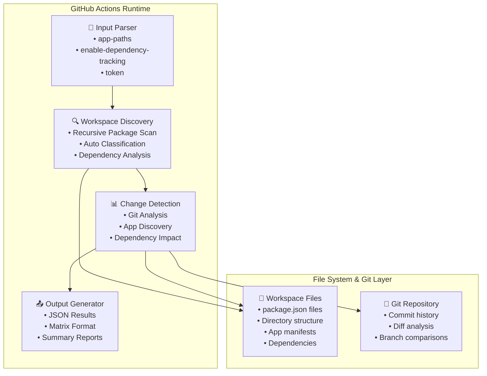
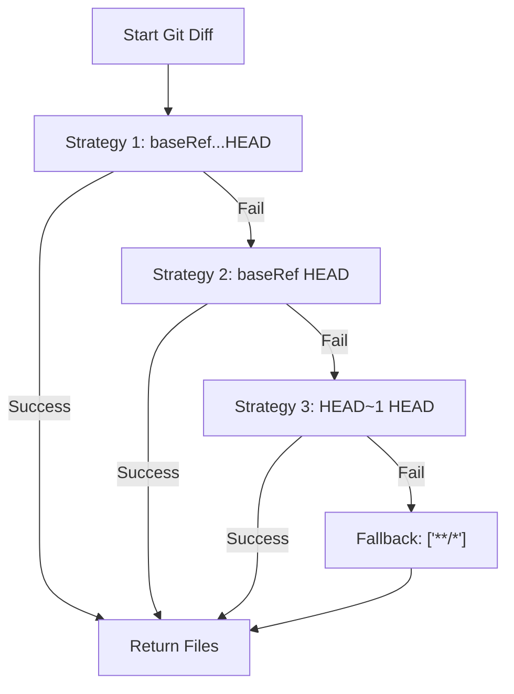
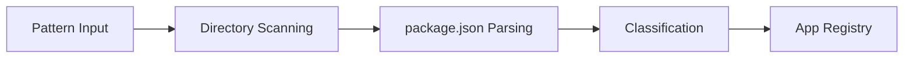
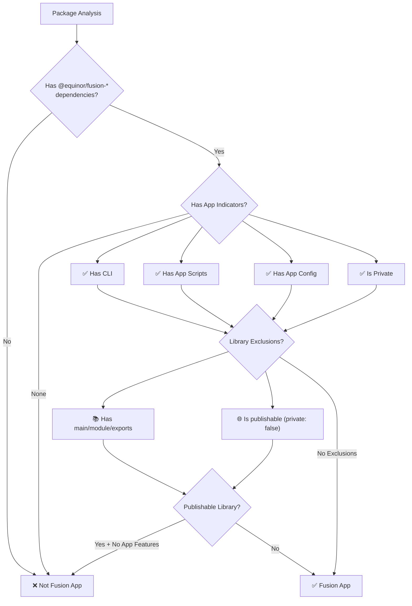
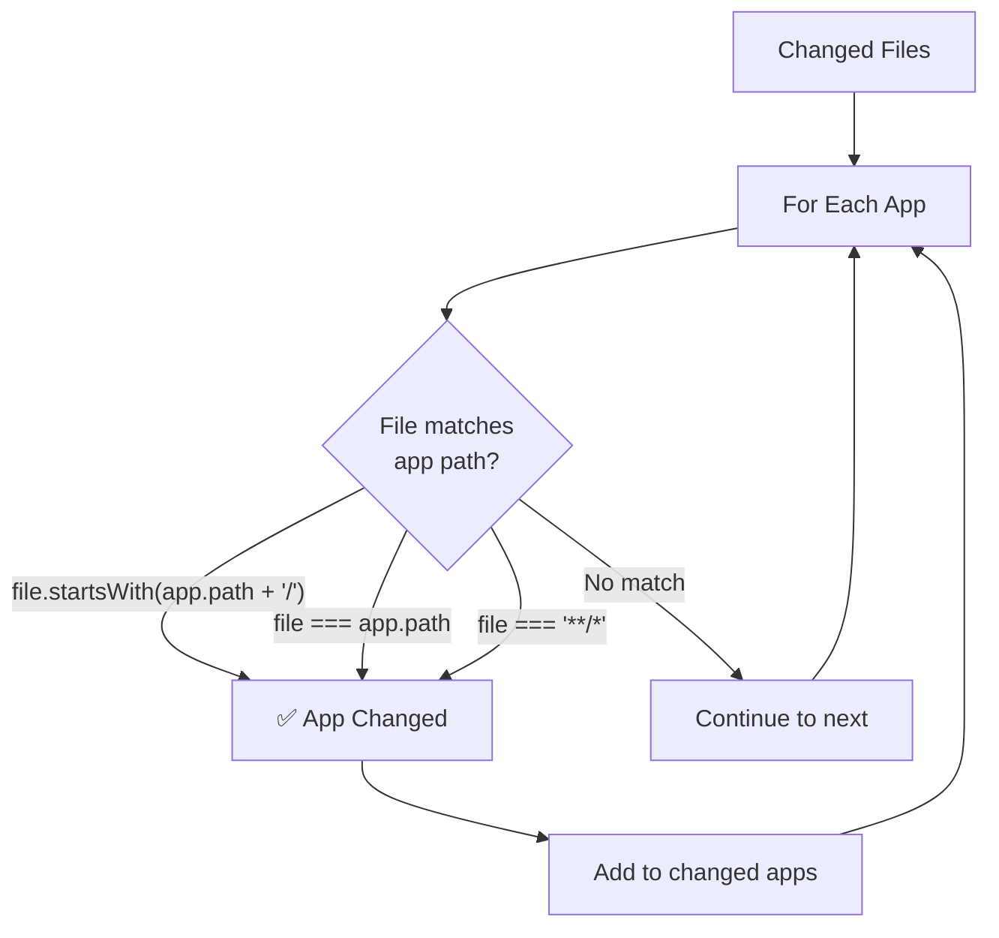
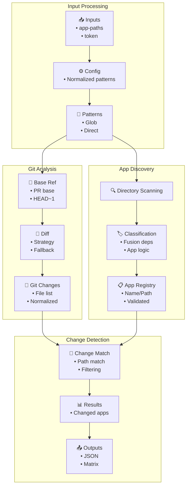
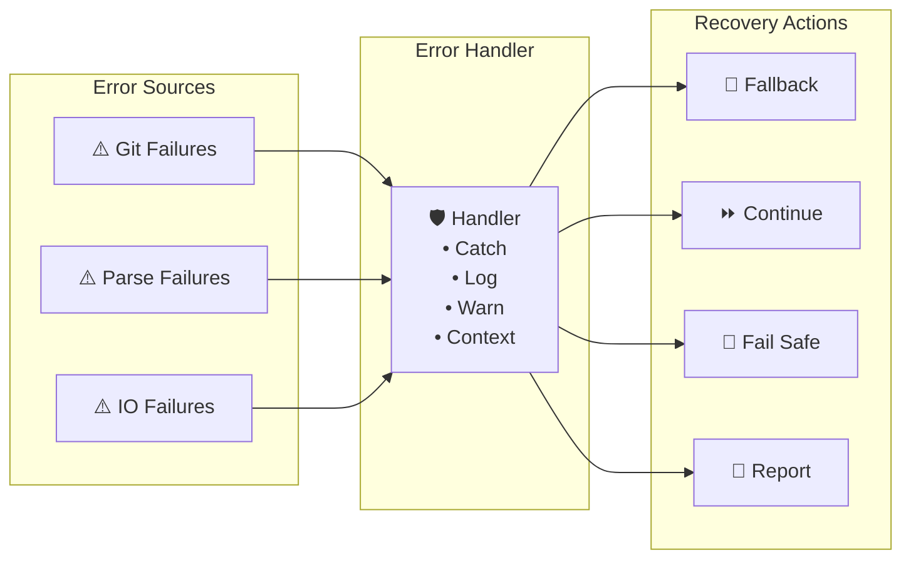
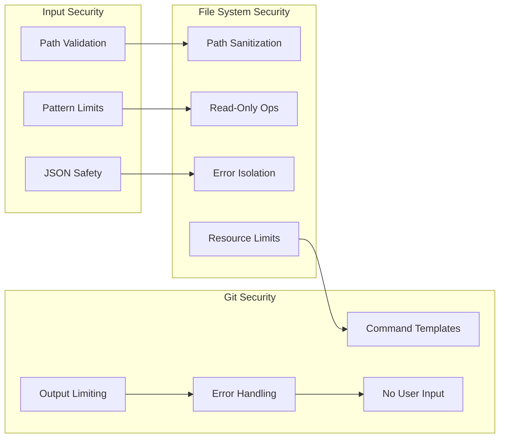
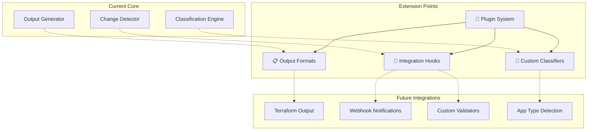
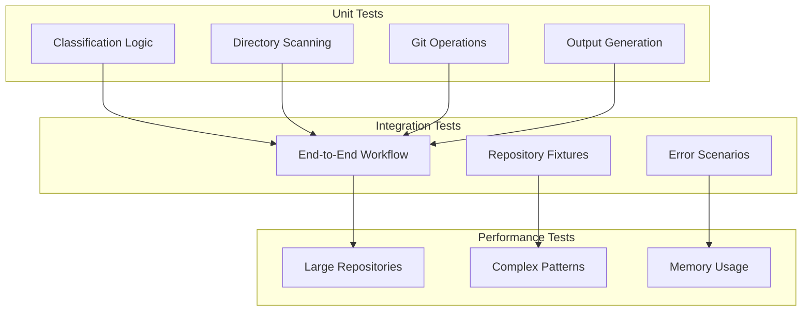

# Architecture Documentation

## Overview

The Fusion App Change Detection Action has been redesigned as a modular, workspace-aware system that intelligently identifies changes in Fusion applications and their dependencies. The architecture emphasizes simplicity, reliability, and comprehensive dependency tracking.

## Implementation Architecture

### Source Code Organization

The action is implemented in TypeScript using a modular architecture for maintainability and testability:

```
src/
├── index.ts              # Main orchestration and entry point
├── types/index.ts        # TypeScript type definitions
├── core/
│   ├── git.ts           # Git operations and diff analysis
│   ├── fusion-app.ts    # App discovery and classification  
│   └── outputs.ts       # GitHub Actions output handling
└── utils/               # Utility functions (reserved)
```

**Module Responsibilities**:
- **index.ts**: Main orchestration, error handling, re-exports for testing
- **types/**: All TypeScript interfaces (FusionApp, PackageJson, etc.)
- **core/git.ts**: Base reference detection and file change analysis
- **core/fusion-app.ts**: App pattern matching and classification logic
- **core/outputs.ts**: GitHub Actions output formatting and error handling

**Build Process**: The modular source is bundled into `dist/index.js` using Vite with TypeScript compilation, external Node.js built-ins, and all dependencies included for GitHub Actions compatibility.

## High-Level Architecture



## Modular Architecture (v2.0)

The action has been refactored into focused, testable modules:

### Core Modules

```
scripts/
├── index.js                     # Main orchestration
├── lib/
│   ├── package-discovery.js     # Workspace scanning & app discovery
│   ├── package-classification.js # App vs Library classification
│   ├── dependency-graph.js      # Dependency analysis & graph building
│   └── change-detection.js      # Git analysis & change detection
└── __tests__/
    ├── simple.test.js           # Legacy compatibility tests
    ├── dependency-tracking.test.js # Dependency features tests
    └── enhanced-dependency-detection.test.js # Advanced dependency tests
```

**Purpose**: Determines what files have changed between commits/branches

**Components**:
- **Reference Strategy**: Smart base-ref selection (PR base, HEAD~1, etc.)
- **Diff Calculator**: Executes git diff commands with fallback strategies
- **File Path Normalizer**: Standardizes file paths for consistent matching

**Git Strategies** (executed in order):


### 3. App Discovery Engine

**Purpose**: Finds and classifies Fusion applications in the workspace

**Discovery Flow**:


**Components**:
- **Pattern Processor**: Handles glob patterns and direct paths
- **Directory Scanner**: Recursively finds candidate directories
- **Package Parser**: Safely parses package.json files
- **App Classifier**: Applies business logic to distinguish apps from libraries

### 4. Classification Engine

**Purpose**: Determines if a package is a deployable Fusion app vs shared library

**Classification Algorithm**:



**Classification Matrix**:

| Criteria | App | Library | Notes |
|----------|-----|---------|-------|
| Has `@equinor/fusion-*` deps | ✅ | ✅ | Required for both |
| Has `fusion-framework-cli` | ✅ | ❌ | Strong app indicator |
| Has build/start scripts | ✅ | ❌ | App-specific scripts |
| Has `fusion`/`fusionApp` config | ✅ | ❌ | Explicit app config |
| Has `main`/`module`/`exports` | ❌ | ✅ | Library structure |
| `private: false` + library structure | ❌ | ✅ | Publishable library |
| `private: true` | ✅ | ⚠️ | Usually app |

### 5. Change Detection Engine

**Purpose**: Maps changed files to affected applications

**Change Detection Flow**:


**Path Normalization**:
- Removes `./` prefix from file paths
- Ensures consistent path separator usage
- Handles edge cases like empty paths

### 6. Output Generation Engine

**Purpose**: Formats results for GitHub Actions consumption

**Output Types**:

| Output | Format | Purpose |
|--------|--------|---------|
| `changed-apps` | JSON Array | Complete app objects for complex logic |
| `changed-app-names` | String | Simple comma-separated list |
| `changed-app-paths` | JSON Array | Paths for file operations |
| `matrix` | GitHub Matrix | Parallel job execution |
| `has-changes` | Boolean String | Conditional workflow steps |
| `summary` | String | Human-readable status |

## Data Flow Architecture

### Primary Data Flow



### Error Handling Flow



## Performance Considerations

### Optimization Strategies

```mermaid
mindmap
  root)Performance(
    Lazy Evaluation
      Only process package.json dirs
      Skip on classification failure
      Short-circuit app indicators
    File Operations
      fs.existsSync() checks
      Targeted directory scanning
      Cached package.json data
    Git Optimization
      --name-only flag
      Fallback strategies
      Limited stdio output
    Pattern Processing
      Parallel when possible
      Avoid recursive patterns
      Fail fast on invalid
```

### Scalability Limits

| Factor | Limit | Mitigation |
|--------|-------|------------|
| Repository size | ~10GB | Use specific patterns, not `**/*` |
| Number of apps | ~1000 | Efficient classification logic |
| File count | ~100k | Git name-only, targeted scanning |
| Pattern complexity | ~50 patterns | Validate and optimize patterns |

## Security Architecture

### Security Layers



### Input Validation

```javascript
// Pattern validation
function validateAppPaths(appPaths) {
  // Prevent path traversal
  if (appPaths.includes('..')) {
    throw new Error('Path traversal not allowed');
  }
  
  // Limit pattern complexity
  if (appPaths.split(',').length > 50) {
    throw new Error('Too many patterns');
  }
}

// JSON parsing safety
function safeParseJson(content) {
  try {
    return JSON.parse(content);
  } catch (error) {
    core.warning(`Invalid JSON: ${error.message}`);
    return null;
  }
}
```

### File System Safety

- **Path Sanitization**: All paths validated and normalized
- **Read-Only Operations**: No file modifications or writes
- **Error Isolation**: File operation failures don't crash entire process
- **Resource Limits**: Bounded file reads and directory scanning

### Git Command Safety

- **Command Sanitization**: Git commands use safe, predefined templates
- **Output Limiting**: Git output restricted with stdio configuration
- **Error Handling**: All git failures handled gracefully
- **No User Input**: Git commands don't accept user-controlled parameters

## Extension Points

### Future Architecture



### 1. Custom Classification Logic

```javascript
// Future: Plugin-based classification
function registerClassifier(name, classifierFn) {
  classifiers.set(name, classifierFn);
}

// Custom app type detection
function classifyAppType(packageJson, appPath) {
  if (hasNextJsConfig(appPath)) return 'nextjs-app';
  if (hasReactScripts(packageJson)) return 'react-app';
  if (hasFusionCli(packageJson)) return 'fusion-cli-app';
  return 'generic-app';
}
```

### 2. Enhanced Output Formats

```javascript
// Future: Configurable output formats
function setOutputs(changedApps, options = {}) {
  if (options.includeMetadata) {
    // Add file change details, timestamps, etc.
  }
  
  if (options.outputFormat === 'terraform') {
    // Generate Terraform-compatible output
  }
}
```

### 3. Integration Hooks

```javascript
// Future: Webhook/API integration
function notifyChanges(changedApps, webhookUrl) {
  // Send change notifications to external systems
}

function validateAppStructure(appPath) {
  // Custom validation logic
  // Integration with linting tools
}
```

## Testing Architecture

### Test Strategy

The codebase uses **Vitest** for testing with comprehensive coverage across all modules:

- **24 test cases** covering all public functions and edge cases
- **Modular testing**: Each core module (git, fusion-app, outputs) tested via main exports
- **Mocked dependencies**: Uses Vitest mocking for @actions/core, fs, and child_process
- **Type safety**: Full TypeScript testing with proper type checking

**Test Structure**:
```typescript
// src/index.test.ts - Single comprehensive test suite
describe("Fusion App Change Detection", () => {
  describe("getBaseRef", () => { /* 4 tests */ });
  describe("getChangedFiles", () => { /* 4 tests */ });
  describe("isFusionApp", () => { /* 6 tests */ });
  describe("findFusionApps", () => { /* 4 tests */ });
  describe("findChangedApps", () => { /* 4 tests */ });
  describe("setOutputs", () => { /* 2 tests */ });
});
```



### Test Data Strategy

- **Synthetic Repositories**: Controlled test environments
- **Real-World Examples**: Anonymized production patterns
- **Edge Cases**: Malformed files, complex structures
- **Performance Tests**: Large repository simulations

This architecture ensures the action is maintainable, extensible, and performant while providing reliable Fusion app detection across diverse repository structures.
